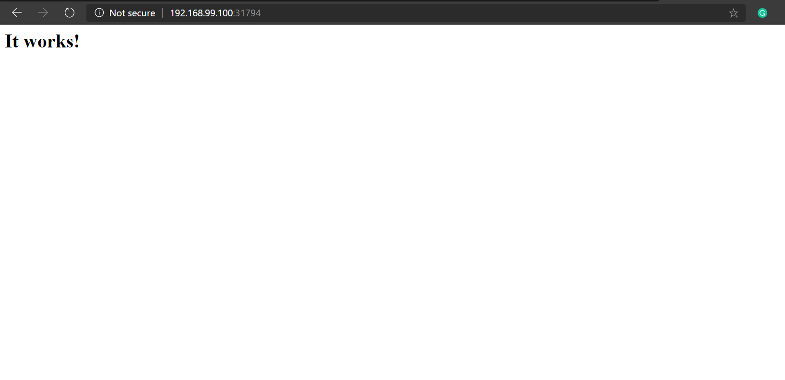

# DEVOPS ASSEMBLY LINES(2020)
## TASK 2
### INTEGRATING JENKINS WITH KUBERNETES
REQUIREMENT:Network Connectivity
* Firstly change the VirtualBox->RHEL8->Network Setting.Enable 2 adapters,adapter 1 will be set to NAT and adapter 2 will be set to Host-Only Network.
* Start RHEL8.Make sure RHEL8 is accessing both the Adapters and connected,by checking the ip using "ifconfig" command.

In RHEL8-
* Make sure there are no pods,deployments or any other resource running.


* Install Kubernetes on RHEL8


* Copy the command and paste onto Terminal


* Make kubectl binary executable and move the kubectl file to /usr/bin folder.


* Get the IP of minikube


***[Here the port number is 8843,therefore the IP becomes http://192.168.99.100:8443]***

* Now in order to create the config file to run kubectl commands we need three files-client.key,client.crt & ca.crt which will be available at following paths-


* Use WinSCP to transfer these files from Windows to RHEL8


* Now run the following command on Terminal in RHEL8


***Now using this command we can create ,run, delete pods/deployements etc ,resources on RHEL8 Kubernetes which will remain in sync with the Kubernetes on your system ,in mycase its Windows 10.***


* Now create the myinfo.yml file which will contain path of the files we copied using WinSCP.It will contain the following code.


Save it.Now we can run kubectl commands easily:
kubectl get pods --kubeconfig myinfo

We can make it simpler by copying the myinfo.yml file to .kube folder with name config .Here are the steps-

```
kubectl config view - This command will show the contents of config file.
```

 * Now login into Jenkins.Create first job(here jk1).It will be FreeStyleProject.
 
  
 
 * Put the GitHub Repository URL,this URL has to contain the following rs1.yml file and must be initialised as well.
 
 
 
 * Execute Shell will contain the following code.
 
 This command will build successfully on first build but on second build it will fail because the pods and ReplicaSet will already be running with the same name.
 
 
 * Therefore update the Execute shell,by putting if and else commands.Here i have also exposed the RS so that i can the HTML page on browser on any system.
 
 
 Thats it!!
 
 Now use curl command to run the RS on Windows
 
 
 The same command will run on RHEL8(use the IP of minikube and port number of RS exposed)
 
 
 
 
 I hope it was helpful.Thankyou!
